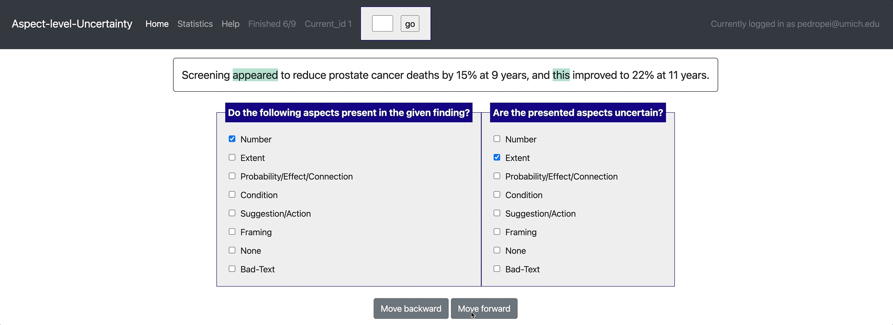
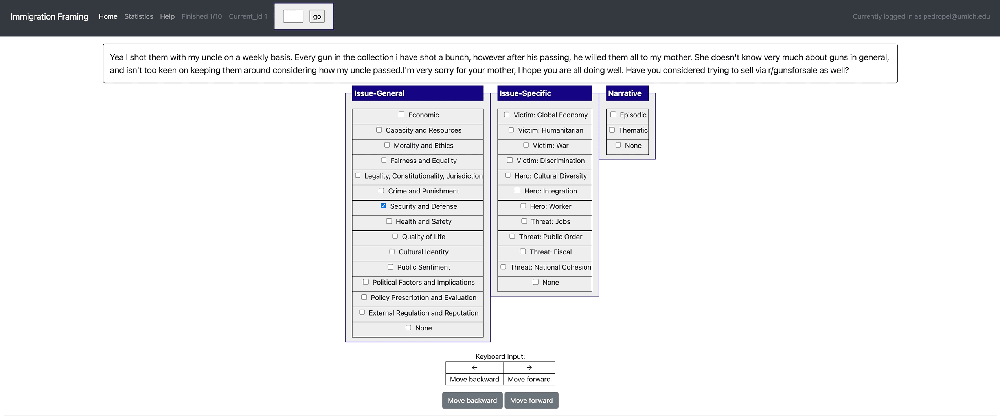

Example projects (project hub)
=====
Potato aims to improve the replicability of data annotation and reduce the cost for researchers to set up new annotation tasks. Therefore, Potato comes with a list of predefined example projects, and welcome public contribution to the project hub. If you have used potato for your own annotation, you are encouraged to create a pull request and release your annotation setup. 

Dialogue analysis (span + categorization)
------------

`yaml config <https://github.com/davidjurgens/potato/tree/master/example-projects/dialogue_analysis>`_

.. code-block::

    [launch] python3 potato/flask_server.py example-projects/dialogue_analysis/configs/dialogue-analysis.yaml -p 8000
    [Annotate] http://localhost:8000

.. image:: ../img/dialogue_analysis.gif
   :width: 1000
   :alt: The log-in screen has an account creation button on the bottom right, circled in red.

Sentiment analysis (categorization)
------------

`yaml config <https://github.com/davidjurgens/potato/tree/master/example-projects/sentiment_analysis>`_

.. code-block::

    [launch] python3 potato/flask_server.py example-projects/sentiment_analysis/configs/sentiment-analysis.yaml -p 8000
    [Annotate] http://localhost:8000

.. image:: ../img/sentiment_analysis.png
   :width: 1000
   :alt: The log-in screen has an account creation button on the bottom right, circled in red.
    
Summarization evaluation (likert + categorization)
------------

.. code-block::

    [launch] python3 potato/flask_server.py example-projects/summarization_evaluation/configs/summ-eval.yaml -p 8000
    [Annotate] http://localhost:8000/?PROLIFIC_PID=user
    
.. image:: ../img/summ_eval.png
   :width: 1000
   :alt: The log-in screen has an account creation button on the bottom right, circled in red.

Match findings in papers and news (likert + prescreening questions + multi-task)
------------

`yaml config <https://github.com/davidjurgens/potato/tree/master/example-projects/match_finding>`_ | `Paper <http://www.copenlu.com/publication/2022_emnlp_wright/>`_ | `Dataset <https://huggingface.co/datasets/copenlu/spiced>`_

.. code-block::

    [Setup configuration files for multiple similar tasks] python3 potato/setup_multitask_config.py example-projects/match_finding/multitask_config.yaml
    [launch] python3 potato/flask_server.py example-projects/match_finding/configs/Computer_Science.yaml -p 8000
    [Annotate] http://localhost:8000/?PROLIFIC_PID=user
    
.. image:: ../img/match_finding.gif
   :width: 1000
   :alt: The log-in screen has an account creation button on the bottom right, circled in red.
   
   
Textual uncertainty (likert + categorization)
------------

`yaml config <https://github.com/davidjurgens/potato/tree/master/example-projects/textual_uncertainty>`_ | `Paper <https://jiaxin-pei.github.io/project_websites/certainty/Certainty-in-Science-Communication.html>`_ | `Dataset <https://github.com/Jiaxin-Pei/Certainty-in-Science-Communication/tree/main/data/annotated_data>`_ 

.. code-block::

    [launch sentence-level] python3 potato/flask_server.py example-projects/textual_uncertainty/configs/sentence_level.yaml -p 8000
    [launch aspect-level] python3 potato/flask_server.py example-projects/textual_uncertainty/configs/aspect_level.yaml -p 8000
    [Annotate] http://localhost:8000
    

   

Immigration framing in tweets (Multi-schema categorization)
------------

`yaml config <https://github.com/davidjurgens/potato/tree/master/example-projects/immigration_framing>`_ | `Paper <https://aclanthology.org/2021.naacl-main.179/>`_ | `Dataset <https://github.com/juliamendelsohn/framing>`_

.. code-block::

    [launch] python3 potato/flask_server.py example-projects/immigration_framing/configs/config.yaml -p 8000
    [Annotate] http://localhost:8000/
    

GIF Reply Appropriateness (video as label)
------------

`yaml config <https://github.com/davidjurgens/potato/tree/master/example-projects/gif_reply>`_ | `Paper <https://aclanthology.org/2021.findings-emnlp.276/>`_ | `Dataset <https://github.com/xingyaoww/gif-reply>`_

.. code-block::

    [launch] python3 potato/flask_server.py example-projects/gif_reply/configs/gif-reply.yaml -p 8000
    [Annotate] http://localhost:8000/

.. image:: ../img/screenshots/gif-reply.gif
    :width: 1000
