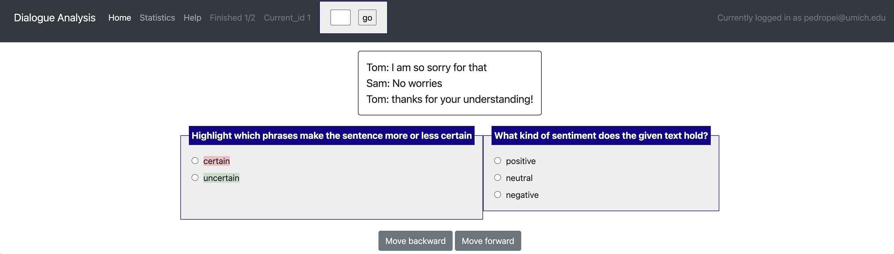
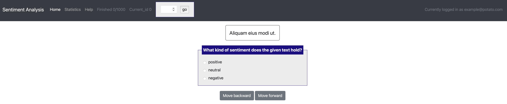
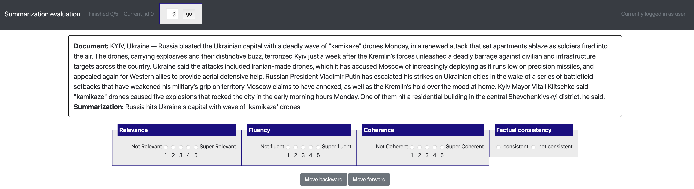
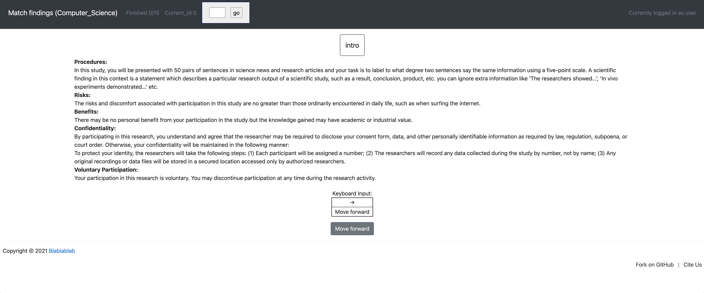

Example projects (project hub)
=====
Potato aims to improve the replicability of data annotation and reduce the cost for researchers to set up new annotation tasks. Therefore, Potato comes with a list of predefined example projects, and welcome public contribution to the project hub. If you have used potato for your own annotation, you are encouraged to create a pull request and release your annotation setup. 

Dialogue analysis (span + categorization)
------------
.. code-block::text

    [launch] python3 potato/flask_server.py example-projects/dialogue_analysis/configs/dialogue-analysis.yaml -p 8000
    [Annotate] http://localhost:8000

Sentiment analysis (categorization)
------------

.. code-block::text

    [launch] python3 potato/flask_server.py example-projects/sentiment_analysis/configs/sentiment-analysis.yaml -p 8000
    [Annotate] http://localhost:8000

    
Summarization evaluation (likert + categorization)
------------
.. code-block::text

    [launch] python3 potato/flask_server.py example-projects/summarization_evaluation/configs/summ-eval.yaml -p 8000
    [Annotate] http://localhost:8000/?PROLIFIC_PID=user
    

Match findings in papers and news (likert + prescreening questions + multi-task)
------------
.. code-block::text

    [Setup configuration files for multiple similar tasks] python3 potato/setup_multitask_config.py example-projects/match_finding/multitask_config.yaml
    [launch] python3 potato/flask_server.py example-projects/match_finding/configs/Computer_Science.yaml -p 8000
    [Annotate] http://localhost:8000/?PROLIFIC_PID=user
    

