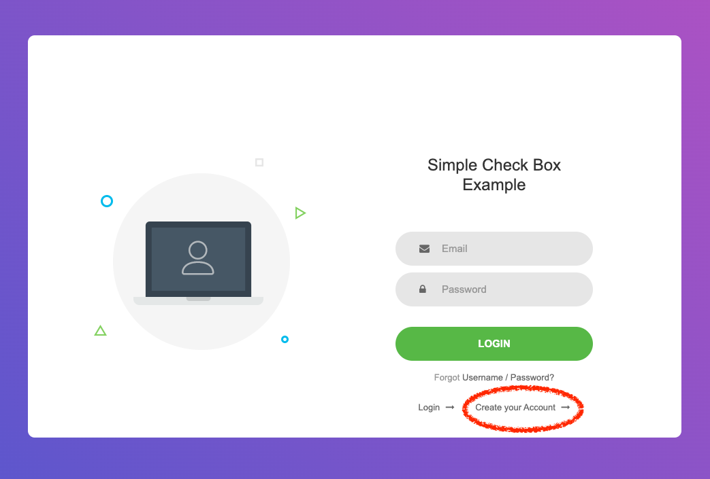

User and collaboration
=====

Sign up and log in
------------
Potato supports self-registration by default. A new user can register for the
annotation task by navigating to the annotation server, then selecting "Create
your account".

After creating an account, you can log in with the email and password used in
the account creation step.

Editing user list in config file
----------------

Collaboration under local network
----------------
